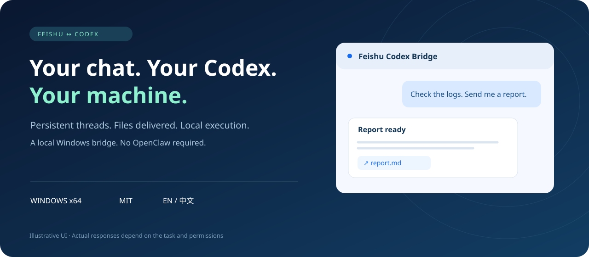

<p align="center"></p>

<p align="center"><a href="README.md">English</a> · <a href="README.zh-CN.md">简体中文</a></p>
<p align="center">Windows x64 · MIT · Feishu ↔ Codex</p>

# Feishu Codex Bridge

**Your chat. Your Codex. Your machine.**

An independent local bridge, without OpenClaw. A setup skill and seven management tools guide configuration; the background service handles messages while Codex runs the work. Keep your PC awake and online.

> Distribution preview: the repository is private; Git installation requires access. Used in the maintainer’s daily workflow with second-computer acceptance completed; not all environments have been verified.

## Features

Persistent conversations · Images and files · Authorization cards · Configurable groups · Quiet reaction feedback

Shared group context, separate private chats. Card replies, with silence when no reply is needed. The independent service can keep working after Codex Desktop closes.

## Install

With a Codex CLI that supports plugin marketplaces:

```powershell
codex plugin marketplace add tynwebilar/feishu-codex-bridge
codex plugin add feishu-codex-bridge@feishu-codex
```

> Set up Feishu Codex Bridge on this Windows PC. Guide me in English.

[Source installation, archives, upgrades and removal](INSTALL.md)

Installing the plugin alone does not start the bridge. Guided setup covers login, configuration, pairing and delivery checks.

## How it works

```text
Feishu ↔ Local bridge ↔ Codex App Server ↔ Workspace & tools
              │
       Durable queue & conversation mapping
```

## Before you connect

Windows x64 only. Bring your own Codex account and Feishu bot. Full access is not restricted to the workspace. Desktop project grouping may require a restart. Git installations require manual background cleanup before plugin removal.

Private chat is owner-only by default; groups start disabled. Grant access only to people you trust with the configured local capabilities. Desktop and bridge cannot write the same conversation simultaneously. International Lark is unverified. Docs and guided setup are bilingual; some runtime menus remain Chinese.

## Development

Node.js 22.22+

```powershell
npm ci
npm test
powershell -NoProfile -ExecutionPolicy Bypass -File scripts/package-plugin.ps1
```

Full Windows bundle: `npm run package:windows`.
Live probes consume quota and create real conversations. Never commit configuration, credentials, logs or attachments.

[User guide / 使用说明](USER-GUIDE.md) · [Release checklist](RELEASE-CHECKLIST.md) · [Implementation history](docs/HISTORY.md)

## License

[MIT](LICENSE). Third-party dependencies retain their licenses. Independent project; not an official OpenAI or Feishu product.

Shared rules: edit the bound workspace’s root `AGENTS.md`. The bridge reads it before each turn and injects changed content into the existing chat without a confirmation turn or service restart. See [details](USER-GUIDE.md).
