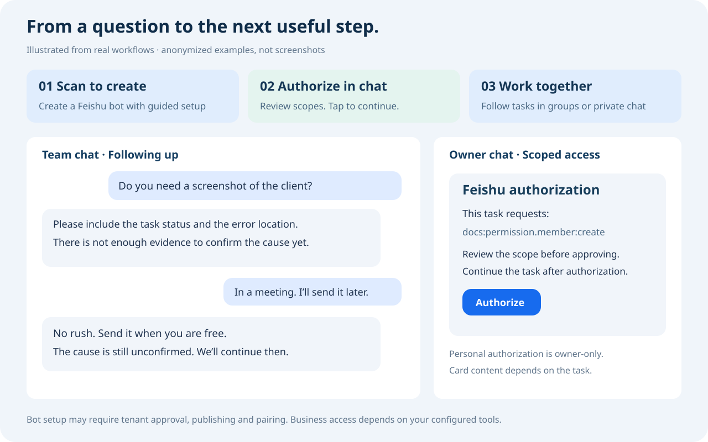

<p align="center"></p>

<p align="center"><a href="README.md">English</a> · <a href="README.zh-CN.md">简体中文</a></p>
<p align="center">Windows x64 · MIT · Feishu ↔ Codex</p>

# Your AI teammate, right in Feishu

**Pick up questions in chat. Move work forward on your PC. Bring the result back.**

A teammate sends a screenshot. The agent asks for the missing details. You say “I’m in a meeting”—it keeps the context. A document task needs access—it sends an authorization card. When the work is done, the report arrives in chat.

Feishu Codex Bridge connects your own Codex to Feishu. Put AI in the conversations where your team already works.

[Get started](#start-working-together) · [User guide](docs/usage.md) · [简体中文](README.zh-CN.md)

## See the workflow



*Illustrated from real usage, not original screenshots. Names, company identifiers, ticket numbers and watermarks are omitted.*

### Follow up without filling the chat

Ask for a screenshot, explain what is still uncertain, then continue when the missing details arrive. Stay silent when no reply is needed. Reaction feedback and card replies keep progress visible without a stream of status messages.

### Scan to create your bot

Guided setup can create a Feishu application by QR code or connect an existing bot. Complete any tenant approvals, app publishing, Codex login and owner pairing.

### Authorize where the conversation happens

For personal Feishu resources, the owner gets a card showing requested permissions and an authorization button in private chat. After authorization, the original task continues without a separate “done” message. This optional feature requires the official Feishu CLI; setup checks for it.

## Give it real work

| Say it in Feishu | What the workflow can do |
| --- | --- |
| “Look at this error screenshot.” | Read the image, ask for missing details, distinguish evidence from guesses. |
| “Check the logs and write a report.” | Use configured log tools or authorized files to collect evidence and summarize findings. |
| “Send me the result as a file.” | Complete the local task and deliver its output to the current chat. |
| “Continue that issue from earlier.” | Continue the conversation without starting the explanation again. |
| “Use this working agreement from now on.” | Edit shared AGENTS.md; existing chats pick it up on their next turn. |

Business access comes from your configured skills, MCP servers, CLIs and account permissions. The bridge connects messages, execution and delivery; it does not include your company's business integrations.

## Start working together

1. **Install the plugin.** Ask Codex: “Set up Feishu Codex Bridge. Guide me in English.”
2. **Connect your own account and bot.** Choose a workspace and execution permissions.
3. **Pair and send a message.** Start with a screenshot, a question or a small task.

With a Codex CLI that supports plugin marketplaces:

```powershell
codex plugin marketplace add tynwebilar/feishu-codex-bridge
codex plugin add feishu-codex-bridge@feishu-codex
```

[Full installation guide](INSTALL.md) · Source and archive installation are also supported. Installing the plugin alone does not start the service.

## Built for ongoing work

- **Shared groups, separate private chats.** Choose which groups and members can use the bot.
- **Continuous context.** Continue across messages and service restarts, or start fresh with /new.
- **Independent background service.** Keep working after Desktop closes; your PC must remain awake and online.
- **One shared working agreement.** Update the workspace's root Markdown rules for the next turn.
- **Your own Codex.** Run locally with your configured tools and working environment.

<details>
<summary>Compatibility and permission boundaries</summary>

Windows x64 preview. International Lark is unverified; some runtime menus remain Chinese. Private chat is owner-only by default and groups start disabled. Full access can reach outside the workspace: admit trusted members only. Desktop and bridge cannot write the same chat concurrently. Project listings may need a Desktop restart. Clean up the service before removing a Git-installed plugin.

</details>

## Development and docs

[User guide](docs/usage.md) · [Contributing](CONTRIBUTING.md) · [Architecture](docs/architecture.md)

Node.js 22.22+. Run `npm ci` and `npm test`. See the contribution guide for packaging and opt-in live probes.

## License

[MIT](LICENSE). Dependencies retain their licenses. Independent project; not an official OpenAI or Feishu product.
