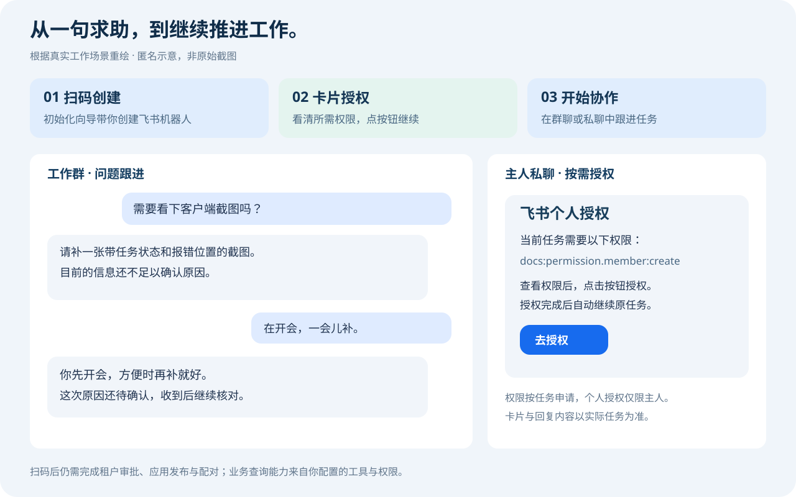

<p align="center"></p>

<p align="center"><a href="README.md">English</a> · <a href="README.zh-CN.md">简体中文</a></p>
<p align="center">Windows x64 · MIT · Feishu ↔ Codex</p>

# 让 AI 成为你的飞书同事

**在群里接住问题，在你的电脑上推进任务，把结果带回聊天。**

同事发来截图，它追问缺失的信息；你说“在开会，一会儿补”，它接住上下文；需要查文档时，先发授权卡片；任务完成后，把报告和文件交回来。

Feishu Codex Bridge 把你自己的 Codex 接入飞书。让 AI 进入团队已经在用的沟通流程。

[开始安装](#几步开始协作) · [使用说明](docs/usage.zh-CN.md) · [English](README.md)

## 看看它怎样参与工作



*根据真实使用案例重绘，非原始截图。姓名、公司标识、工单号与水印未收录。*

### 会跟进，也知道什么时候等待

不是收到每条消息都抢着回答。它可以追问截图、说明证据不足，在你补充信息后继续处理；判断无需回复时保持安静。正在处理用表情反馈，回复用卡片呈现，让群里少一点噪声。

### 扫码创建，跟着向导接入

没有机器人也能开始：初始化向导支持扫码创建飞书应用，也能接入已有机器人。再完成必要的租户审批、应用发布、Codex 登录和主人配对。

### 授权就在聊天里完成

访问个人飞书资源时，在主人私聊中展示所需权限和授权按钮。你确认后继续原来的任务，不必复制一串链接，也不用再发一句“已授权”。个人资源访问需要官方飞书 CLI，向导会检查是否安装。

## 把这些工作交给它

| 你在飞书里说 | 它可以怎样协作 |
| --- | --- |
| “看看这张报错截图。” | 读取图片、追问缺失信息，区分线索与已确认原因。 |
| “查一下日志，整理个报告。” | 使用你配置的日志工具或已授权文件，给出结论和证据。 |
| “把结果做成文件发我。” | 在本机完成任务，将生成文件交付到当前聊天。 |
| “刚才那个问题继续。” | 沿用当前会话上下文，不必重讲背景。 |
| “以后都按这份工作规范来。” | 修改共享 AGENTS.md，已有会话下一轮读取，无需逐个同步。 |

业务系统、日志和文档的具体访问能力来自你配置的 Skills、MCP、CLI 与账号权限；插件负责把消息、执行和交付接起来，不自带你公司的业务连接。

## 几步开始协作

1. **安装插件**，告诉 Codex：“帮我初始化飞书 Codex 桥接”。
2. **连接你自己的账号与机器人**，选择工作区和执行权限。
3. **完成配对，发出第一条消息**，从截图、问题或一个小任务开始。

使用支持插件市场的 Codex CLI：

```powershell
codex plugin marketplace add tynwebilar/feishu-codex-bridge
codex plugin add feishu-codex-bridge@feishu-codex
```

[完整安装指南](INSTALL.zh-CN.md) · 支持源码安装和压缩包安装。仅安装插件不会自动启动后台。

## 为持续协作准备

- **群聊共享，私聊独立**：明确选择哪些群、哪些成员可以使用。
- **会话持续**：多轮交流与服务重启后继续上下文，也可用 /new 重新开始。
- **富文本输入**：支持保留缩进的原生代码块，以及图片、文字和表情混排。
- **后台独立**：退出 Codex 桌面后仍可工作；电脑需保持开机、联网且不休眠。
- **规则集中维护**：工作区根目录的一份 Markdown，下一轮自动生效。
- **使用自己的 Codex**：本机运行，复用已配置的工具与工作环境。

<details>
<summary>兼容性与权限边界</summary>

Windows x64 预览版；国际版 Lark 尚未验证，部分运行菜单仍为中文。私聊默认仅主人，群聊默认关闭。完全访问可读取工作区外资源，只向信任的成员开放。桌面与桥接不能同时写同一会话，项目列表可能需要重启桌面刷新。Git 安装需先清理后台再移除插件。

</details>

## 开发与文档

[使用说明](docs/usage.zh-CN.md) · [开发贡献](CONTRIBUTING.md) · [架构](docs/architecture.md)

Node.js 22.22+，运行 `npm ci` 和 `npm test`。打包与真实探针说明见开发指南。

## License

[MIT](LICENSE)。第三方依赖保留各自许可。独立项目，非 OpenAI 或飞书官方产品。
