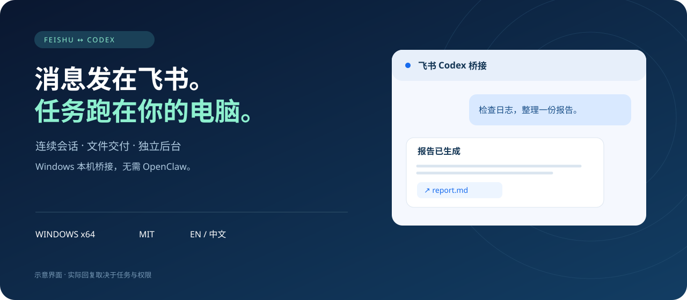

<p align="center"></p>

<p align="center"><a href="README.md">English</a> · <a href="README.zh-CN.md">简体中文</a></p>
<p align="center">Windows x64 · MIT · Feishu ↔ Codex</p>

# 飞书 Codex 桥接

**消息发在飞书，任务跑在你的电脑。**

独立本机桥接，无需 OpenClaw。插件提供初始化 Skill 和七个管理工具，后台负责消息收发，Codex 执行任务。电脑需要保持开机、联网且不休眠。

> 分发预览：仓库目前私有，命令安装需要仓库访问权限。已投入维护者日常使用，并完成跨电脑验收，不代表所有环境均已验证。

## 功能

连续会话 · 图片与文件交付 · 授权卡片 · 群聊权限 · 安静的表情反馈

群内共享上下文，私聊独立。普通回复使用卡片，无需回复时保持安静。后台独立运行，关闭 Codex 桌面版后仍可收发消息。

## 安装

使用支持插件市场的 Codex CLI：

```powershell
codex plugin marketplace add tynwebilar/feishu-codex-bridge
codex plugin add feishu-codex-bridge@feishu-codex
```

> 帮我初始化飞书 Codex 桥接，一步步引导我完成配置。

[源码安装、压缩包、升级与卸载](INSTALL.zh-CN.md)

仅安装插件不会启动桥接。引导会帮助你登录、配置、配对及验收。

## 工作方式

```text
Feishu ↔ Local bridge ↔ Codex App Server ↔ Workspace & tools
              │
       Durable queue & conversation mapping
```

## 使用边界

仅支持 Windows x64，需要自己的 Codex 账号与飞书机器人。完全访问不局限于工作区目录。桌面项目归组可能需要重启刷新。Git 安装需要先完整清理后台，再移除插件。

私聊默认仅主人，群聊默认关闭。只向你信任的成员开放所配置的本机能力。飞书桥接与桌面端不能同时写同一会话。国际版 Lark 尚未验证。文档及引导支持中英文，部分运行菜单仍为中文。

## 开发

Node.js 22.22+

```powershell
npm ci
npm test
powershell -NoProfile -ExecutionPolicy Bypass -File scripts/package-plugin.ps1
```

完整 Windows 包： `npm run package:windows`.
真实探针会消耗额度并创建会话。不要提交配置、凭据、日志或附件。

[User guide / 使用说明](USER-GUIDE.md) · [Release checklist](RELEASE-CHECKLIST.md) · [Implementation history](docs/HISTORY.md)

## License

[MIT](LICENSE). 第三方依赖保留各自许可。独立项目，非 OpenAI 或飞书官方产品。
